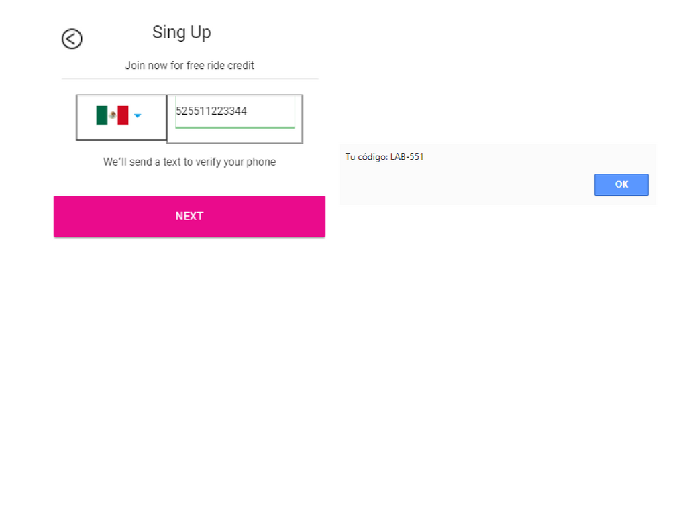

# **Foodmap**

-----------------------------------------------------------------
-----------------------------------------------------------------

## **Objetivo**

Desarrollar una aplicación móvil que replique el sitio de Lyft.

## **Conocimiento técnico**

- HTML
- CSS
- Gryd System
- Responsive Web Design
- Bootstrap
- jQuery / Javascript

## **Flujo de la Aplicación**

Vista splash con duración de 2 a 5 segundos que redirecciona a la vista de inicio. La vista de inicio cuenta con dos botones, pero solo se sigue el flujo de **SIGN UP**.

En la siguiente vista tenemos un formulario donde el usuario puede escoger el país y debe ingresar su número de teléfono. El botón de **NEXT** debe estar deshabilitado hasta que se ingrese un número de 10 dígitos.

Una vez ingresado el número de teléfono se habilita el botón y al dar click debe enviar una alerta con un código generado aleatoriamente (LAB-000) y redireccionar a la siguiente vista.

En esta vista se debe ingresar el código dado anteriormente y una vez hecho esto se habilita el botón que redirecciona al usuario a la vista donde ingresa sus datos.

Para ingresar sus datos necesitamos un formulario que le pida su nombre, apellido y correo electrónico. Deberá también tener un checkbox para que se acepten los términos y condiciones del servicio.

Ya que se ha realizado lo anterior, sólo se deberá mostrar una vista al usuario que le indique que ha concluido con el registro exitosamente.

## **A tener en cuenta**

- Se debe cumplir los pasos necesarios para que los usuarios puedan registrarse.
- Todas las vistas deben de contar con una manera de regresar a la vista anterior.